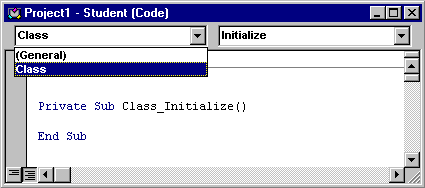



## Introduction to Class Programming in VB

### Description

This tutorial is intended for student who are new to Class programming in Visual Basic. The Series Articles are still in development but here the 3 portion of this articles.
 
### More Info
 

             |
---                |---
**Submitted On**   |2003-04-19 01:32:44
**By**             |[Dante Salvador](https://github.com/Planet-Source-Code/PSCIndex/blob/master/ByAuthor/dante-salvador.md)
**Level**          |Intermediate
**User Rating**    |4.7 (33 globes from 7 users)
**Compatibility**  |VB 5\.0, VB 6\.0
**Category**       |[Object Oriented Programming \(OOP\)](https://github.com/Planet-Source-Code/PSCIndex/blob/master/ByCategory/object-oriented-programming-oop__1-47.md)
**World**          |[Visual Basic](https://github.com/Planet-Source-Code/PSCIndex/blob/master/ByWorld/visual-basic.md)
**Archive File**   |[Introducti162543872003\.zip](https://github.com/Planet-Source-Code/dante-salvador-introduction-to-class-programming-in-vb__1-47486/archive/master.zip)

